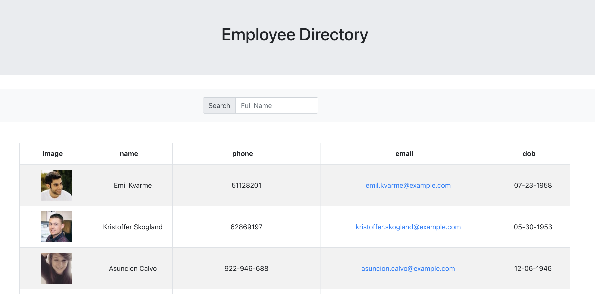

# Employee-Directory

## Description

An employee or manager would benefit greatly from being able to view non-sensitive data about other employees. It would be particularly helpful to be able to filter employees by name.

As a user, I want to be able to view my entire employee directory at once so that I have quick access to their information.

## Deployed Link

https://polar-wildwood-11159.herokuapp.com/

## Images

## Installation

npx create-react-app appname

npm axios:
Axios is a library that helps us make http requests to external resources. In our React applications we often need to retrieve data from external APIs so it can be displayed in our web pages. Axios uses methods like get() and post() that perform http GET and POST requests for retrieving or creating resources.
https://dev.to/cesareferrari/working-with-axios-in-react-540c
https://www.npmjs.com/package/axios#features

When running the code locally the local host is set to port 3000

To start the app use npm start

## Languages

React.js
Axios
React-Boostrap
Heroku

## Contribute

The following is a set of guidelines for contributing. These are just guidelines, not rules, so use your best judgement and feel free to propose changes to this document in a pull request.

Issue: Ensure the bug was not already reported by searching on GitHub under issues. If you're unable to find an open issue addressing the bug, open a new issue. Write detailed information: For example:

How to reproduce the issue, step-by-step. The expected behavior (or what is wrong). Screenshots for GUI issues. The application version. The operating system.

Pull Requests: Pull Requests are always welcome.

When you edit the code, please run npm run test to check the formatting of your code before you git commit. Ensure the PR description clearly describes the problem and solution. It should include: The operating system on which you tested. The relevant issue number, if applicable.

## Mentions

Used this repo for guidance:
https://github.com/iarcones/react-employee-directory

## License

MIT
